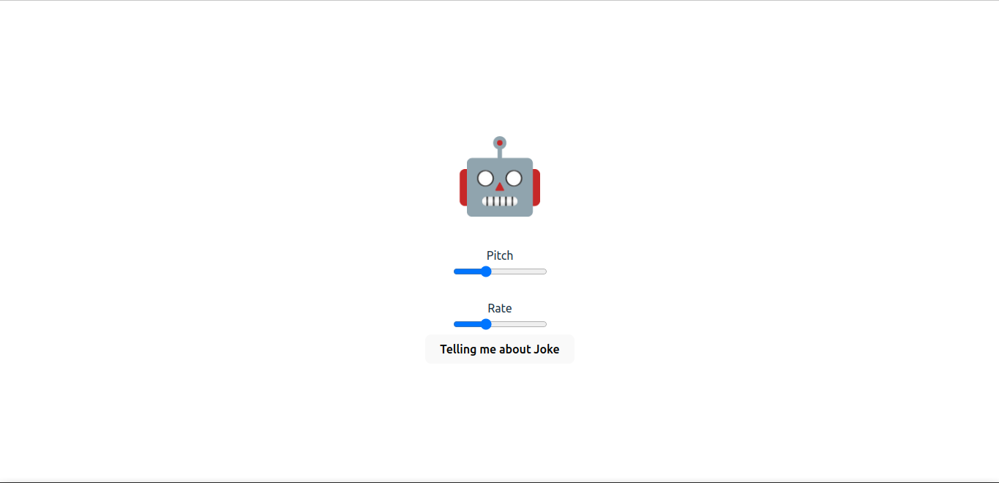

# DevProjects - Joke telling bot web app

This is an open source project from [DevProjects](http://www.codementor.io/projects). Feedback and questions are welcome!
Find the project requirements here: [Joke telling bot web app](https://www.codementor.io/projects/web/joke-telling-bot-web-app-cjd2eyrfak)

## Tech/framework used

Built with Vue JS, Typescript, Vueuse

## Features

- **Modular Architecture**: Split into components (JokeFetcher, VoiceControls, KeyboardHandler)
- **Enhanced Error Handling**: Retry mechanisms with exponential backoff
- **Data Validation**: Proper validation for fetched jokes
- **Accessibility**: Semantic HTML and ARIA attributes
- **Comprehensive Testing**: Unit tests for all components with Vitest
- **Type Safety**: Full TypeScript support

## Screenshots and demo

Screenshots of your app and/or a link to your live demo


## Installation

1. Install dependencies: `pnpm install`
2. Run tests: `pnpm test`
3. Build the app: `pnpm build`
4. For development: `pnpm dev`

### Environment Variables
Create an `.env` file with:
```
VITE_JOKE_URL=https://your-jokes-api.com/jokes
```

## Project Structure

```
src/
├── components/
│   └── Joke/
│       ├── JokeFetcher.vue    # Handles joke fetching with retry logic
│       ├── VoiceControls.vue  # Manages speech synthesis controls
│       └── KeyboardHandler.vue # Handles keyboard shortcuts
├── __tests__/                # Unit tests for all components
└── App.vue                   # Main application orchestrator
```

## License

[MIT](https://choosealicense.com/licenses/mit/)
Most open source projects use the MIT license. Feel free to choose whichever license you prefer.

Note: 
    - Use Google Web Browser for better experience
    - I forget try another Web Browser