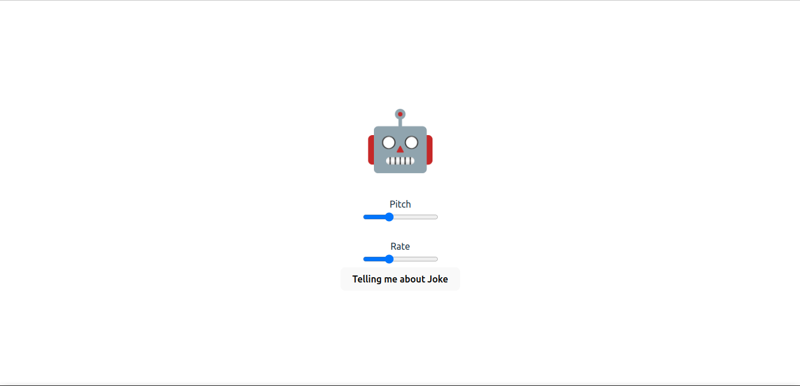

# Joke Telling Bot Web App

This is an open source project from [DevProjects](http://www.codementor.io/projects). Feedback and questions are welcome!
Find the project requirements here: [Joke telling bot web app](https://www.codementor.io/projects/web/joke-telling-bot-web-app-cjd2eyrfak)

## Tech/framework used

Built with Vue 3, TypeScript, Vite, Web Speech API

## Features

- **Text-to-Speech Jokes**: Fetches jokes from an API and reads them aloud using the browser's SpeechSynthesis API
- **Voice Controls**: Adjustable pitch (0.5–2) and rate (0.5–2) sliders
- **Keyboard Shortcut**: Press `J` to fetch and play a new joke
- **Joke Display**: Setup and punchline rendered in a styled card
- **Retry with Exponential Backoff**: Failed API calls retry up to 3 times with configurable delays
- **Request Cancellation**: In-flight requests are aborted via AbortController on new fetches
- **Toast Notifications**: Auto-dismissing snackbar with configurable duration
- **Dark/Light Theme**: Respects `prefers-color-scheme`
- **Accessibility**: ARIA roles, `aria-live` regions, semantic HTML, screen-reader-only headings
- **Browser Compatibility**: Detects SpeechSynthesis support; handles Chrome async voice loading
- **Type Safety**: Full TypeScript support with strict mode
- **Comprehensive Testing**: 28 unit tests across 7 test files with Vitest
- **Optimized Build**: Vendor code-splitting (Vue in separate chunk), ES2020 target, CSS minification

## Screenshots and demo

Screenshots of your app and/or a link to your live demo


## Installation

1. Install dependencies: `pnpm install`
2. Run tests: `pnpm test`
3. Build the app: `pnpm build`
4. For development: `pnpm dev`

### Environment Variables
Create an `.env` file with:
```
VITE_JOKE_URL=https://your-jokes-api.com/jokes
```

## Project Structure

```
src/
├── components/
│   ├── Joke/
│   │   ├── JokeFetcher.vue       # Fetches jokes with retry + cancellation
│   │   ├── VoiceControls.vue     # Speech synthesis controls + joke display
│   │   └── KeyboardHandler.vue   # Keyboard shortcut handler
│   └── Toast.vue                 # Auto-dismissing notification snackbar
├── composables/
│   └── useSpeechSynthesis.ts     # Web Speech API wrapper with debounce
├── __tests__/                    # Unit tests (7 files, 28 tests)
├── App.vue                       # Main application orchestrator
├── store.ts                      # Global toast state (shallowRef)
├── types.d.ts                    # IDataJoke type definition
└── style.css                     # Global styles (dark/light theme)
```

## License

[MIT](https://choosealicense.com/licenses/mit/)